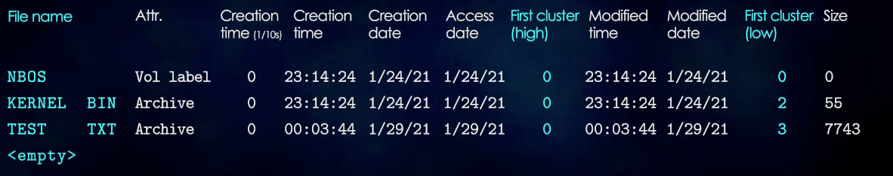

# How file systems works
 - The file systems are like libraries. It's a system of organizing data on a disk.
 - Typically organized on a disk in a heirarchical manner

# Commonly used file systems
  - NTFS
    + Windows default
    + Supports journaling, compression, encryption, and more
  - FAT
    + Default on old windows and ms-dos
    + Commonly used on flash drives and embedded devices
    + Easy to learn, but very simple and inflexible
  - APFS
    + Default on OSX
    + Made to improve on the limitations of HFS+
    + Supports snapshots, encryption, compression, and more
  - HFS+
    + Default on old versions of OSX (High Sierra and older)
    + Derived from HFS (filesystem on very first macs)
    + Supports journaling, compression, encryption and more.
    + "HFS+ is probably the worst file system ever." - Linus Torvalds
  - ext
    + Used on linux
    + ext3 introduced journaling
  - `We will use fat12 because of its simplicity`
  
# Fat 12
  - Disk
    1. Reserved portion
      + This contains the bootloader, size of sector, volume id, serial #
    2. File allocation tables
      + Loojup table to get the location of the next block
    3. Root directory
      + TOC of the disk
        - contains filename, location, size, attributes, etc.
    4. Data
      + Contains the actual contents of the files
  
  - Calculations
    To calculate the size of the reserved portion measured in sectors, just use `bpb_reserved_sectors` (1)
    To calculate the size of the file allocation tables `bpb_fat_count * bpb_sectors_per_fat` (18)
    To calculate the size of the root directory `(bpb_dir_entry_count * 32 + bpb_bytes_per_sector - 1) / bpb_bytes_per_sector` (14)  

## The root directory
  - 

## Reading clusters
  ```
  lba = data_region_start + (cluster - 2) * sectors_per_cluster
  35    1 + 18 + 14          3              2
  ```
## The file allocation table
  - 